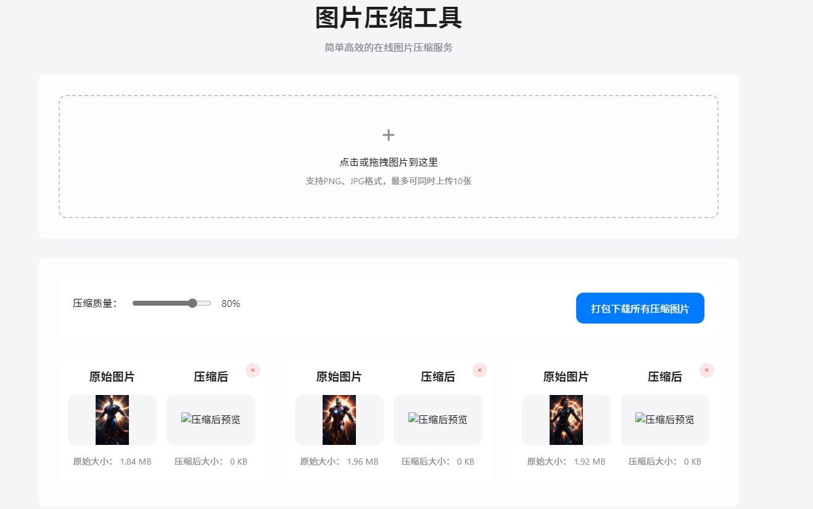

# 图片压缩工具

一个简单高效的在线图片压缩工具，可以帮助您快速压缩PNG和JPEG图片，减小文件体积，提高网站加载速度和节省存储空间。



## 🚀 特点

- 🔄 **简单易用** - 拖放上传，一键压缩多张图片
- 🖼️ **智能压缩** - 三种压缩模式适应不同场景需求
- 📊 **数据对比** - 直观展示压缩前后的图片大小对比
- 📱 **响应式设计** - 适配桌面和移动设备
- 🔌 **无需后端** - 完全在浏览器中处理，保护隐私
- 📦 **批量下载** - 一键下载所有压缩后的图片

## 🛠️ 技术特点

- **多种压缩模式**：
  - 高质量模式 - 最大程度保留图像细节
  - 平衡模式 - 兼顾文件大小和图像质量
  - 极限压缩模式 - 最大程度减小文件体积

- **智能算法**：
  - 智能格式转换 - 根据内容特点自动选择最佳格式
  - 自适应调整尺寸 - 根据图片大小智能缩放
  - PNG图像颜色量化 - 减少颜色数量降低文件大小
  - 透明度智能处理 - 自动识别透明通道并优化

- **先进的JPEG优化**：
  - 智能色彩处理 - 极限模式下降低色彩饱和度减少信息量
  - 质量自适应调整 - 根据图像内容智能选择最佳压缩质量

- **WebP支持**：
  - 在支持的浏览器中使用更高效的WebP格式

## 💻 使用方法

1. 打开网页（可通过GitHub Pages访问）
2. 点击上传区域或直接拖放图片到页面中
3. 选择合适的压缩模式和质量
4. 预览压缩效果并比较文件大小
5. 下载单张压缩图片或打包下载所有图片

## 兼容性

- 支持所有现代浏览器：Chrome、Firefox、Safari、Edge等
- 建议使用最新版本的浏览器获得最佳体验

## 开发

项目使用原生JavaScript开发，无需构建工具，可直接在浏览器中运行。

```
git clone https://github.com/cygoodyu/image-compressor.git
cd image-compressor
```

然后在浏览器中打开`index.html`即可。